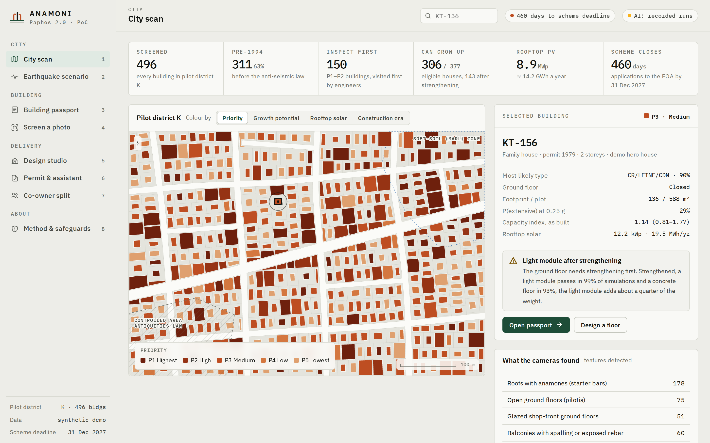
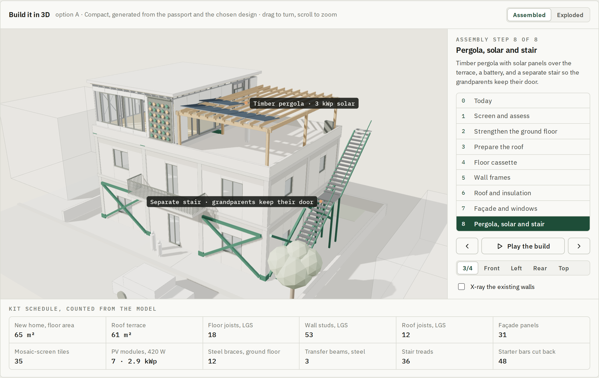

# ANAMONI · AI that lets Paphos grow upward, safely

Proof of concept for the **Pafos 2.0 AI Innovation Competition** (Municipal Youth Council and Municipality of Paphos, University category).

ANAMONI screens every building in a city for earthquake risk, tells each owner whether their house is likely to carry a new floor and what it needs first, designs the strengthening and a light prefabricated rooftop home, and pre-checks the permit. It is built for the family-home scheme announced by the Interior Ministry on 9 September 2026, which lets families add a home of up to 150 m² above their house until 31 December 2027, and whose published texts say nothing about checking the structure underneath.

- **Live demo (AI runs live for viewers signed in to Claude):** https://claude.ai/artifact/PuxTkPPh7BHdij3pXKeP4R
- **Mirror (no sign-in; AI steps replay recorded runs):** https://karimkassabaki.github.io/anamoni-paphos/
- **Walkthrough video (2 min 44 s, 1080p):** https://youtu.be/OeiP5xToBwU





## What it does

| View | What it shows | How it works here |
|---|---|---|
| City scan | 496 buildings of a pilot district coloured by priority, growth potential, solar or era; engineer visit queue | Computed in the browser |
| Building passport | Front elevation with detected features, ETEK-style screening form with confidence, structural-type fusion, fragility curves, "can it carry a floor?", engineer checklist | Computed in the browser |
| Screen a photo | Upload a street photo; a vision-language model fills the screening fields with evidence, image region and confidence; the engines turn them into a draft passport | **Live AI** (Claude vision); recorded run on the sample façade |
| Design studio | A family brief produces three costed options on the Pareto front, all passing the safety check, a bill of quantities, and a 3D model that builds the new home in 8 steps, explodes into its parts and counts its own kit schedule | Computed in the browser; 3D in three.js |
| Permit & assistant | Rule-by-rule permit pre-check with sources; a Greek/English assistant that answers only from 40 sourced scheme rules | **Live AI** (Claude, mandatory citations); recorded answers to four sample questions |
| Co-owner split | Fair cost split for an exoskeleton on a 1983 apartment block with an open ground floor | Exact Shapley value over 720 joining orders |
| Earthquake scenario | Damage map, expected impacts and ranked inspection list for a chosen earthquake | Attenuation relation + the same fragility models |
| Method & safeguards | A test bench of 24 automated checks run on every load; a 16-question assistant evaluation; every model, parameter and safeguard | Computed; the evaluation runs live on Claude |

**The pilot district is synthetic on purpose.** A real street with risk scores next to real addresses would create exactly the stigma ANAMONI's design forbids. Geometry, attributes and detected features are generated by `tools/gen_district.py` from seeded distributions.

## First test on real Paphos buildings

On 1 October 2026 the team photographed three older buildings with rooftop starter bars from the public street in Paphos and screened each photo with the PoC's own vision prompt on Claude, with no other information. It counted the storeys on all three, found the starter bars on all three roofs (marking the thinnest at 0.50 confidence rather than guessing) and read all three as concrete frames with infill walls. It missed one thing: two wide garage openings that weaken the apartment block's ground floor, which it listed as an engineer check but did not reflect in its reading. It never used the word "safe". Three photos are a first check, not a validation; Gate 1 of the pilot rates 420 buildings blind. The photos are in Part D of the submission and are not published here.

## Run it

Open `index.html` in any modern browser. It is one self-contained file (about 1.4 MB, fonts, data and the three.js 3D library embedded): no server, no install, and it works offline except for the live AI calls. Keys `1`–`8` switch views.

## Rebuild it

```bash
npm install @fontsource/ibm-plex-sans @fontsource/ibm-plex-mono   # fonts embedded by the build
pip install shapely                                                # only to regenerate the district
python3 tools/gen_district.py      # writes poc/district.json
npm install three@0.128.0                                          # embedded in the standalone build
python3 poc/build.py               # writes poc/dist/index.html and poc/dist/standalone.html
```

`poc/dist/standalone.html` is the copy served as `index.html` at the root of this repository.

## How the engines work (`poc/src/engine.js`)

- **Structural type**: Bayesian fusion. A prior over four ESRM20-style classes (unreinforced masonry; RC frame with no, low or moderate seismic design) from the permit year, updated by image evidence (column grid visible, façade detailing).
- **Damage probability**: lognormal fragility curves per class, mixed over the type probabilities, with modifiers for open ground floors (×0.65), glazed ground floors (×0.8), four or more storeys (×0.9) and irregularity (×0.9).
- **Priority**: probability of extensive damage at a reference shaking of 0.25 g, raised for spalling balconies and occupancy. Confidence below 60% moves a building up a level, never down.
- **Can it carry a floor?**: capacity index C = ground-floor lateral resistance ÷ seismic demand (2.5 × a × S / q), over 400 seeded Monte Carlo samples of type, floor weight, column ratio, material strength and infill. Scenarios: as built, + concrete floor (11.5 kN/m²), + concrete floor with a strengthened ground floor, + light kit (3.1 kN/m²), + light kit with a strengthened ground floor. The threshold is C ≥ 1 in at least 90% of samples.
- **Design search**: every combination of floor area (5 m² steps up to the roof or scheme limit), frame, ground-floor strengthening, pergola PV and battery is capacity-checked; survivors are filtered to the Pareto front on cost, area and bill savings.
- **Co-owner split**: exact Shapley value of a cost game where the ground-floor works serve everyone, each façade frame serves its side, roof insulation serves the top floor and each balcony module serves its flat.
- **3D model** (`poc/src/model3d.js`): generated from the passport and the chosen design with three.js; instanced meshes for studs, joists and tiles; an 8-step assembly sequence and exploded view; quantities counted from the geometry.
- **Test bench** (`poc/src/tests.js`): 24 checks on the models, safety rules and data (probabilities sum to 1, fragility monotonic, Monte Carlo reproducible and converged, extra weight always lowers capacity, brute-force Pareto check, Shapley efficiency, no output says "safe", every citation valid), plus a 16-question assistant evaluation scored on citation validity, grounding, behaviour and language.
- **Earthquake scenario**: Campbell (1997)-form attenuation for PGA with site factors (1.2 firm, 1.45 soft soil), run through the same fragility models.

All parameters are screening-level and indicative, shown in the Method view, and replaced by engineer-validated values (ESRM20, Cypriot studies, OpenSees-trained surrogates) in the pilot.

## AI calls

Both AI features call Claude through the Claude artifact runtime (`window.claude.use("sample")`). When the page is opened anywhere else (this repository, GitHub Pages, from disk) there is no runtime, so those two panels replay recorded runs and say so on screen. The prompts are visible in the app: the vision prompt asks for strict JSON with a value, confidence, image region and evidence per field and forbids the word "safe"; the assistant receives the knowledge base in `data/scheme_kb.json` and must cite a rule ID for every factual sentence.

## Responsible AI

ANAMONI never outputs "safe", only a priority level; uncertainty sends an engineer. A licensed engineer assesses on site and signs every design. Street imagery is public-street only with faces and plates blurred on the device; building scores are visible only to owners and authorities. See Part B, section 11 of the submission; the testing protocol is section 9.

## Honest limits

- The district and its detected features are synthetic demo data.
- Structural parameters are indicative, not calibrated.
- Agreement with engineers has not been measured yet; it is Gate 1 of the pilot (κ ≥ 0.61 and ≥ 85% agreement, zero dangerous misses).
- The PoC ranks and designs; it certifies nothing.

## Repository layout

```
index.html              the app (standalone build)
poc/src/                styles.css, body.html, engine.js, model3d.js, ui1.js, ui2.js, tests.js, ui3.js
poc/district.json       synthetic pilot district
poc/rec_screen.json     recorded vision run on the sample façade
poc/rec_chat.json       recorded assistant answers
poc/build.py            builds poc/dist/
data/scheme_kb.json     40 sourced rules for the assistant
tools/gen_district.py   procedural district generator
docs/                   screenshots
package.json            build dependencies (fonts, three.js)
```

## AI-use disclosure

Claude (Anthropic) was used extensively under the team's direction: for much of the desk research, for drafting, and to write the code of this proof of concept. The team reviewed and edited the material and takes responsibility for it.

## Team

Team ANAMONI · Karim Kassabaki (team leader) and Karim Kozbar, AUB Mediterraneo · Pafos 2.0 AI Innovation Competition, 2026. Intellectual property remains with the team, as the competition rules provide.
